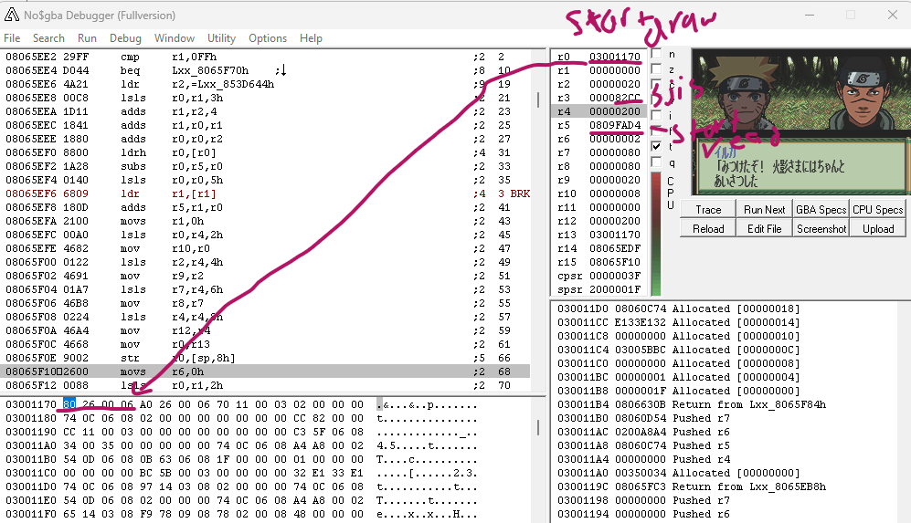

**The motha fuckin font**

The draw and checks for 2byte vs 1byte is basically FUN_08065eb8

The image data is called at 08065ef6

by the time you get to 08065ef6 the registers tell the whole story
