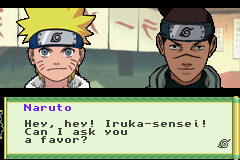

# Naruto Konoha Senki ROM Extractor and Injector CLI

Naruto: Konoha Senki is a game released in 2003 for the Gameboy Advance. It never saw a western release. The game follows the early Naruto storyline up to the Chuunin Exams, featuring tactical, turn-based battles and a campaign that mostly follows the Anime story.

The aim of this project is to create tools for reverse engineering the ROM so that we can translate it into English.

## Features

### Extraction
- Extract Shift-JIS 1-byte font characters as BMP files
- Extract character and item names/descriptions
- Extract dialog name labels (characters and locations)
- Extract menu text

### Injection
- Inject custom font BMPs into ROM
- Inject edited dialog scripts
- Inject entity names and descriptions
- Inject dialog name labels
- Inject menu text
- Apply ASM patches
- Full ROM patch mode (all injections at once)

## Requirements

- Python 3.10+
- Required Python modules (install via `pip install -r requirements.txt`)
- A legal copy of the Naruto Konoha Senki ROM

## Installation
`pip install -r requirements.txt`

## Usage

Run the script with a subcommand based on what you want to do.

General format:
`python main.py <command> [options]`

If you just want to patch the rom with all the commands:
`python main.py patch_rom -i /path/to/game.gba -w`

### Commands Overview

| Command | Purpose |
|--------|---------|
| extract_font | Dump 1-byte SJIS font tiles to BMP |
| extract_entities | Dump names + descriptions of characters/items |
| extract_name_labels | Dump dialog name labels (characters/places) |
| extract_menu | Dump menu text |
| inject_font | Inject custom BMP font tiles |
| inject_dialogs | Insert edited dialog scripts |
| inject_entities | Insert edited entity names/descriptions |
| inject_name_labels | Insert edited dialog name labels |
| inject_menu | Insert edited menu text |
| inject_asm | Apply ASM patches |
| patch_rom | Run all available injections in sequence |

### Example Commands

#### Extract Font
`python main.py extract_font -i game.gba -o ./extract/font -s sjis.tbl`

#### Inject Font
`python main.py inject_font -i base.gba -f ./inject/font -o output.gba`

#### Extract Entities
`python main.py extract_entities -i game.gba -o ./extract/entities`

#### Inject Dialogs
`python main.py inject_dialogs -i base.gba -f ./inject/dialogs -o output.gba`

#### Apply All Patches
`python main.py patch_rom -i base.gba -o patched.gba`

### Overwriting ROM Behavior

All inject commands support:

- `--input_rompath` (`-i`)
- `--output_rompath` (`-o`)
- `--overwrite_output_rom` (`-w`)

If `-w` is provided, the output ROM will be overwritten with the input ROM before applying changes.

### Help

Run to view full usage details:

`python main.py --help`

Or command-specific help:

`python main.py extract_font --help`
